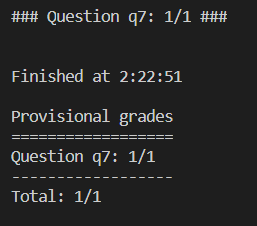

### Question 1 - Value Iteration           
```python
python autograder.py -q q1
```


### Question 2 - Bridge Crossing Analysis
```python
python autograder.py -q q2
```


### Question 3 - Policies
```python
python autograder.py -q q3
```


### Question 4 - Q-Learning
```python
python autograder.py -q q4
```


### Question 5 - Epsilon Greedy
```python
python autograder.py -q q5
```


### Question 6 - Bridge Crossing Revisited
```python
python autograder.py -q q6
```


### Question 7 - Q-Learning and Pacman
```python
python autograder.py -q q7
```


### Question 8 - Approximate Q-Learning
```python
python autograder.py -q q8
```


